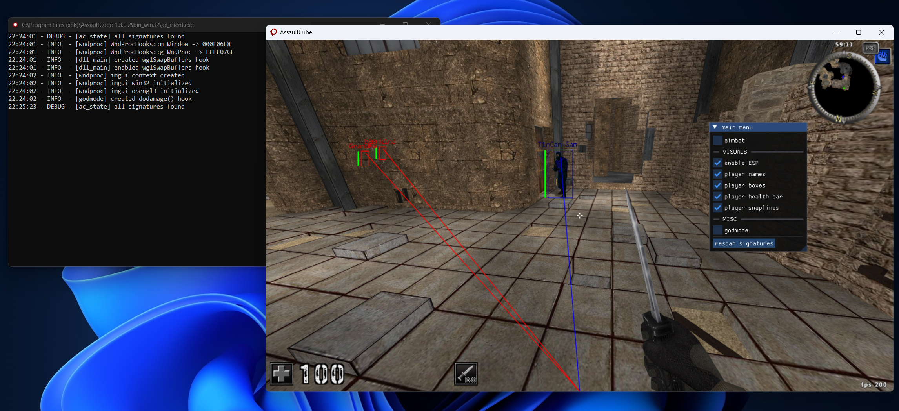

# Internal Mod Menu for Assault Cube v1.3.0.2

<p align="center">
  
</p>

## What ?
A showcase of memory manipulation and graphical overlay rendering techniques by means of function hooking, applied to an executing target process. It includes features such as:
- **ESP**: Player model bounding boxes, health bars, names and snaplines.
- **Aimbot**: Programatically aiming at targets based on their proximity in the game world.
- **Godmode**: Mutating game functions to nullify damage.
- **ImGui Menu**: Interfacing with the program features.

The general process entails loading a (compiled) shared library ("dynamic-link library", in Windows) into a target process's memory space, enabling direct target memory access from our "injected" binary.

## Why ?
To explore and understand:
1. **Memory manipulation**: Reading and writing to arbitrary memory addresses to alter program behavior.
2. **Function hooking**: Intercepting and modifying the execution flow of the target program.
3. **Overlay rendering**: Drawing arbitrary visual elements onto frames of the graphics pipeline using OpenGL.
4. **Signature scanning**: Locating arbitrary structures (functions, pointers, etc.) in the target process's binary by matching their byte patterns.

## Disclaimer
This project is strictly for **educational purposes only**. We do not condone cheating in competitive games. Any use of this code or concepts in may violate terms of service agreements and/or local laws.

## Getting Started

### Building the Project
1. Clone the repository:

```
git clone https://github.com/Hotz99/
```

2. Open the solution in Visual Studio.
3. Ensure the configuration is set to **Debug** or **Release**.
4. Build the project to produce the DLL.

### Usage
1. Inject the compiled library into the target process using an injector of your choice.
2. Use `INSERT` to open/close the menu and interact with the features.

**Note**: If you injected the library before starting a (singleplayer) game mode, open the menu and press "rescan signatures". 